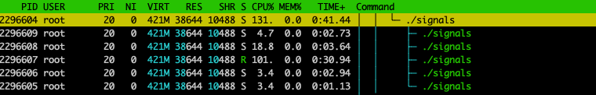

# Steps

Create and run a scone docker container using:
```
docker run -it -v "$PWD":/src registry.scontain.com/sconecuratedimages/crosscompilers:ubuntu
```

In the docker container create a C file that registers a signal handler for SIGFPE using the command below: 
```
cat > signals.c << EOF
#include <stdio.h>
#include <signal.h>
#include <setjmp.h>
#include <string.h>

jmp_buf fpe;

void handler(int signum)
{
    // Do stuff here then return to execution below
    printf("in sigfpe handler\n");
    longjmp(fpe, 1);
}


int main()
{
    volatile int i, j;

    struct sigaction act;
    struct sigaction oldact;
    memset(&act, 0, sizeof(act));
    act.sa_handler = handler;
    act.sa_flags = SA_SIGINFO;
    sigaction(SIGFPE, &act, &oldact);


    if (0 == setjmp(fpe))
    {
        printf("Waiting\n");
          int x = 0;
     //    j = i / 0;
       while(1){
          x++;
          if (x%10000 == 0){
                printf("Waiting\n");
          }


       }
    }
    printf("After for condition\n");

    return 0;
}
EOF
```
This example waits for the signal to be injected using busy loop 

Compile the file using:
```
gcc -o signals signals.c
```
Then setup the configuration as below
```
cat > sgx-musl.conf << EOF
Q 1
e -1 0 0
s -1 0 0
EOF
```
Finally, run the app using the command below 
```
SCONE_CONFIG="$PWD"/sgx-musl.conf SCONE_VERSION=1 ./signals
```

Now, the app waits for the signal and multiple ./signals.c processes are spawned as shown in the screenshot below:


Inject a signal to the running process (R) using the kill utility 
```
sudo kill -8 <pid>
```
This results in the handler being executed with an output as shown below:
```
Waiting
Waiting
Waiting
Waiting
Waiting
Waiting
Waitingin sigfpe handler
After for condition
```