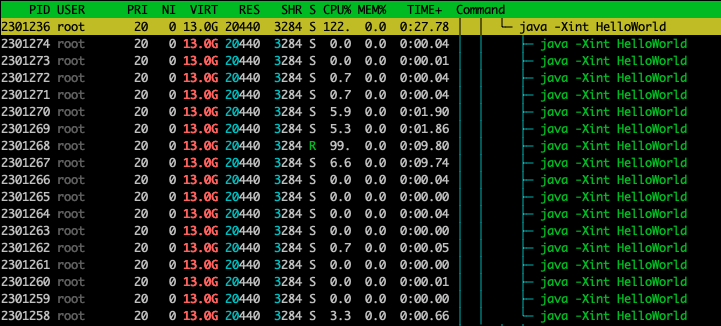

# Steps
First, create a scone Java container 
```
docker run $MOUNT_SGXDEVICE -it registry.scontain.com/sconecuratedimages/apps:11-jdk-alpine /bin/bash
```
Create a Java file which catches the `ArithmeticException` as shown below:
```
cat > HelloWorld.java << EOF
public class HelloWorld {

    public static void main(String[] args) {
        System.out.println("Starting");
        try{
            int x = 0;
            while(true){
                // x = x/x;
                x = x+1;

 	    }

        }catch(ArithmeticException e){
            System.out.println("Woops!ArithmeticException caught");
        }
    }

}
EOF
```
Compile the java app using :
```
javac HelloWorld.java
```
Then run it using:
```
java -Xint HelloWorld
```
This spawns java processes that busy wait as shown in the screenshot below :



To inject a SIGFPE sucessfully, we use a kernel module that sets the right singal number and error code for the signal. Further, this modules injects a signal from the kernel. 
For this compile the kernel module in `./sig_usr_inject/`` using 
```
make all
```
Once the `.ko` file is created sucessully inject the signal into the running (R) java process using the `inject.sh` script
```
cd sig_usr_inject
sudo ./inject.sh <pid>
```

This triggers an `ArithmeticException` in the java application and executes the `catch` block as shown below:
```
Starting
Woops!ArithmeticException caught
```
